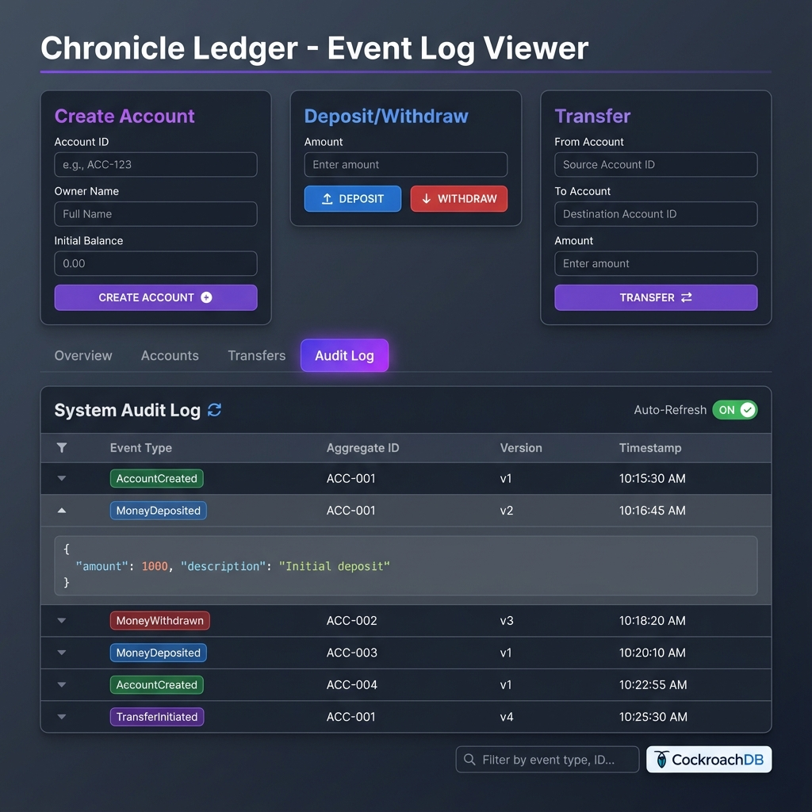

# Chronicle Ledger

> **Modern Event-Sourced Banking System** with CQRS, Time-Travel Queries, and High Availability

<div align="center">


**Tech Stack**


**Patterns**


</div>

---

## 🚀 Quick Start

**Full setup in 5 minutes**:  
👉 See **[docs/GETTING_STARTED.md](./docs/GETTING_STARTED.md)** for the complete walkthrough.

```bash
# 1. Start infrastructure
docker-compose up -d

# 2. Initialize CockroachDB
Get-Content infra/cockroach/init.sql | docker exec -i chronicle-cockroach ./cockroach sql --insecure

# 3. Start services
npm install && npm run dev

# 4. Run tests
node scripts/e2e-test.js
```

Dashboard: `http://localhost:3000`

---

## 📸 Screenshots

### System Architecture


### Time-Travel Queries (NEW! ⏰)


### Event Log Viewer Dashboard


---

## ✨ Key Features

### 🎯 Core Banking Operations
- ✅ **Create Account** - Initialize accounts with owner and balance
- ✅ **Deposit Money** - Add funds to accounts
- ✅ **Withdraw Money** - Remove funds with overdraft protection
- ✅ **Transfer Between Accounts** - Atomic cross-account transfers

### ⏰ Time-Travel Queries (NEW!)
Query account balance at **any point in history**:
```http
GET /accounts/ACC-001/balance-at?timestamp=2026-01-01T10:00:00Z
```
**How it works**: Replay events from the immutable event store up to the specified timestamp.

### 📊 Real-Time Event Log Viewer
- **Auto-refresh** event stream (2-second intervals)
- **Filter** by event type, aggregate ID, or payload data
- **Expandable details** with JSON syntax highlighting
- **Copy-to-clipboard** for debugging

### 🔒 Event Sourcing Benefits
- **Complete Audit Trail** - Every state change is recorded
- **Compliance Ready** - Immutable event log for forensics
- **Debugging** - Replay events to reproduce bugs
- **Analytics** - Historical data analysis without snapshots

---

## 🏗️ Architecture

### System Architecture

*Complete system architecture showing all components and data flow*

### Complete Data Flow

*All 5 use cases: Create Account, Deposit, Transfer, Withdraw, and Time-Travel Query*

### Transaction Lifecycle

*The journey of $100 from user click to database consistency (~170ms total)*

---

## 🧪 Testing & Scripts

### End-to-End Verification
```bash
node scripts/e2e-test.js
```
Tests all features: Create → Deposit → Transfer → Withdraw → Time-Travel → Audit Log

### System Consistency Check
```bash
node scripts/verify-consistency.js
```
Compares event store events vs read model consistency

### Load Testing
```bash
# Continuous traffic simulation
node scripts/simulate-traffic.js --continuous
```

---

## 📚 Documentation

### Setup & Operations
- **[docs/GETTING_STARTED.md](./docs/GETTING_STARTED.md)** - Complete walkthrough guide (START HERE)

### Architecture & Design
- **[ARCHITECTURE.md](./docs/ARCHITECTURE.md)** - System Architecture & API Contracts
- **[EVENT_SOURCING.md](./docs/EVENT_SOURCING.md)** - Pattern explanation
- **[INTERVIEW.md](./docs/INTERVIEW.md)** - Interview preparation

---

## 🎯 Project Purpose

This project demonstrates **senior-level** mastery of:

### 1. Event Sourcing
- **Append-only** immutable event log
- **State derivation** from event replay
- **Time-travel** debugging capabilities

### 2. CQRS (Command Query Responsibility Segregation)
- **Separate write model** (CockroachDB events)
- **Optimized read model** (PostgreSQL materialized views)
- **Async synchronization** via NATS

### 3. Distributed Systems
- **Strong consistency** (CockroachDB strict serializability)
- **High availability** (fault tolerance)
- **Event-driven architecture** (loose coupling)

### 4. Modern Full-Stack
- **Backend**: Node.js/TypeScript with Fastify
- **Frontend**: Next.js 14 with React Server Components
- **Infrastructure**: Docker Compose orchestration

---

## 🔧 Tech Stack

| Component           | Technology        | Purpose                                  |
| ------------------- | ----------------- | ---------------------------------------- |
| **Event Store**     | CockroachDB       | Immutable event log with ACID guarantees |
| **Read Model**      | PostgreSQL        | Materialized views for fast queries      |
| **Message Bus**     | NATS              | Event distribution (pub/sub)             |
| **Write API**       | Node.js + Fastify | Command endpoints                        |
| **Read API**        | Node.js + Fastify | Query endpoints                          |
| **Event Processor** | Node.js           | NATS consumer + view builder             |
| **Dashboard**       | Next.js 14        | Admin UI with real-time updates          |

---

## 💡 Learning Outcomes

After exploring this project, you'll understand:

- ✅ **Event Sourcing** architecture pattern
- ✅ **CQRS** separation of reads/writes
- ✅ **Time-travel queries** via event replay
- ✅ **Distributed transactions** in CockroachDB
- ✅ **Event-driven messaging** with NATS
- ✅ **Materialized view** patterns
- ✅ **High availability** through replication
- ✅ **Chaos engineering** principles

---

## 📈 Senior Engineering Proof Points

### ✅ Event Sourcing Mastery
- Immutable event log design
- Event replay for state reconstruction
- Time-travel query implementation

### ✅ Distributed Systems
- CockroachDB strict serializability
- Raft consensus understanding
- Partition tolerance handling

### ✅ System Design
- CQRS pattern implementation
- Async event processing
- Materialized view optimization

### ✅ Full-Stack Execution
- Backend API design (REST)
- Modern React UI (Next.js 14)
- Docker infrastructure setup

---

## 🚀 Future Enhancements

- [ ] Idempotency key enforcement
- [ ] Account suspension/closure workflows
- [ ] Multi-currency support validation
- [ ] Rate limiting
- [ ] Authentication & authorization
- [ ] Prometheus metrics export
- [ ] Grafana dashboards
- [ ] Load testing benchmarks

---

## 📝 License

MIT License - See [LICENSE](./LICENSE) for details

---

## 👨‍💻 Author

**Harshan Aiyappa**  
Senior Full-Stack Engineer  
📧 [GitHub](https://github.com/Kimosabey)

---

**Built with**: Event Sourcing • CQRS • CockroachDB • PostgreSQL • NATS • Next.js  
**Patterns**: Time-Travel Queries • High Availability • Distributed Systems
