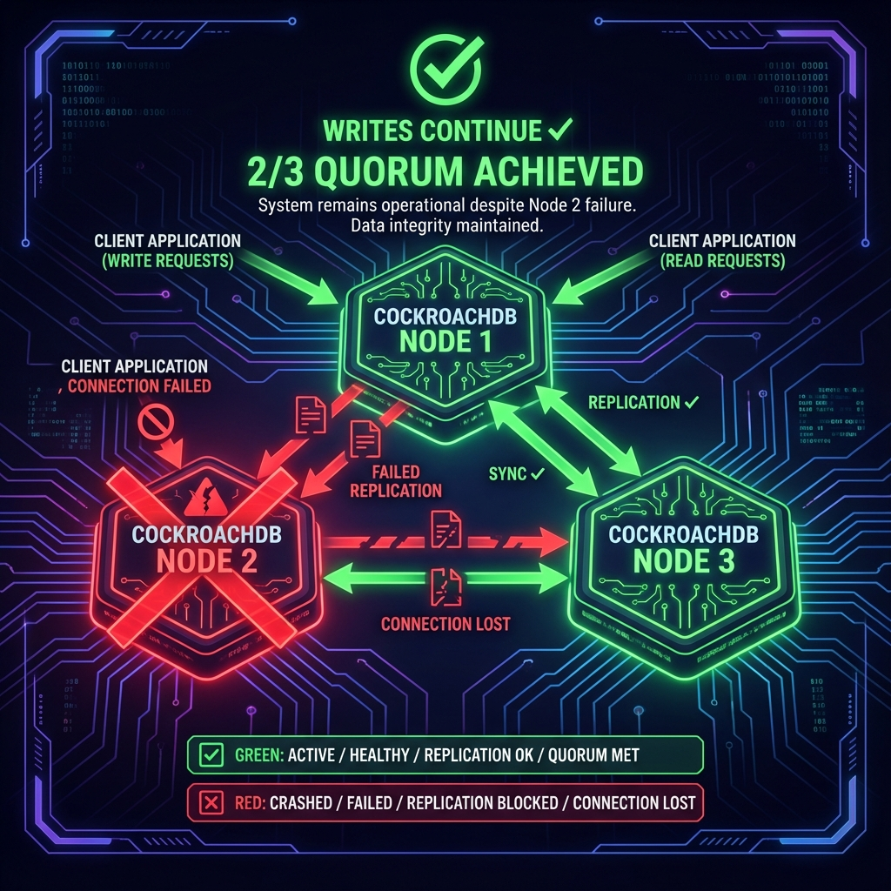
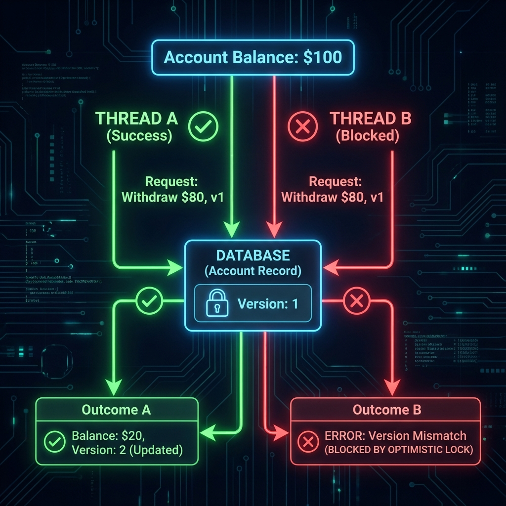

# ChronicleLedger

> **Immutable Audit Ledger with Event Sourcing**  
> A distributed, fault-tolerant system that proves high availability and linearizability using CockroachDB clustering.

<div align="center">


**Tech Stack**


**Patterns**


</div>

---

## Live Demos

> **Note**: Full animated GIFs will be added after implementation. Current placeholders show the concept.

### High Availability in Action
**Demo**: Kill a database node mid-transaction, writes continue!

<p align="center">
  
</p>

*Killing CockroachDB Node 2 - writes still succeed with 2/3 quorum*

### Event Sourcing Time Travel
**Demo**: Query account balance from any point in history

<p align="center">
  
</p>

*Replaying events to see balance at 2 PM yesterday*

### Concurrent Write Protection
**Demo**: 100 parallel withdrawals, zero overdrafts

<p align="center">
  
</p>

*Optimistic locking prevents race conditions*

---

## Project Purpose

**Senior Signal**: This project demonstrates mastery of **Event Sourcing**, **Distributed Consensus**, and **High Availability** patterns essential for Senior Hybrid Engineer roles.

### The Core Concept
Traditional databases store **current state**. ChronicleLedger stores **immutable events** and derives state from the complete event history. This provides:
- Complete audit trail
- Time-travel debugging
- Compliance & forensics
- Distributed fault tolerance

---

## Architecture

### Tech Stack
- **Database**: CockroachDB (3-Node Cluster) - Distributed SQL with ACID guarantees
- **API**: Node.js (Express/Fastify) - Ledger write/read endpoints
- **Messaging**: NATS - Event notification bus
- **State Store**: PostgreSQL - Materialized views of current state
- **UI**: Next.js - Admin dashboard with event timeline

### Data Flow
```
[Client] 
   ↓ (Write Event)
[Ledger API (Node.js)]
   ↓
[CockroachDB Cluster]
   ├─→ Node 1
   ├─→ Node 2  ← (Kill this during demo!)
   └─→ Node 3
   ↓ (Event Published)
[NATS Message Bus]
   ↓ (Subscribe)
[Read Processor Service]
   ↓ (Update Materialized View)
[PostgreSQL State DB]
   ↓ (Query)
[Next.js Dashboard]
```

---

## Senior Engineering Proof Points

### 1. Event Sourcing
- Events are **append-only** and **immutable**
- Current state is **derived**, not stored
- Complete history enables time-travel and auditing

### 2. Linearizability
- CockroachDB guarantees **strict serializability**
- All clients see the same order of events
- No lost updates under concurrent writes

### 3. High Availability
- **Demonstration**: Kill 1 of 3 CockroachDB nodes mid-transaction
- **Result**: Writes continue successfully (2/3 quorum)
- **Recovery**: Node rejoin without data loss

### 4. Distributed Transactions
- Multi-row inserts maintain ACID properties
- Saga pattern for cross-service consistency

---

## Project Structure

```
chronicle-ledge/
├── docs/
│   ├── HLD.md                    # High-Level Design
│   ├── LLD.md                    # Low-Level Design (API Contracts)
│   ├── FAILURE_SCENARIOS.md      # Chaos Engineering Guide
│   ├── EVENT_SOURCING.md         # Pattern Explanation
│   └── LINEARIZABILITY.md        # Proof of Consistency
├── services/
│   ├── ledger-api/               # Node.js Write API
│   ├── read-processor/           # NATS Consumer + Materialized View Builder
│   └── query-api/                # Node.js Read API
├── ui/
│   └── dashboard/                # Next.js Admin UI
├── infra/
│   ├── docker-compose.yml        # CockroachDB 3-Node + NATS + Postgres
│   └── cockroach/                # DB Initialization Scripts
└── scripts/
    ├── simulate-traffic.js       # Load Testing
    ├── kill-node.sh              # Chaos Test (Node Failure)
    └── verify-consistency.js     # Linearizability Check
```

---

## 🚀 Quick Start

### Prerequisites
- Docker & Docker Compose
- Node.js 20+
- 8GB RAM (for 3-node CockroachDB cluster)

### Step 1: Start Infrastructure
```bash
cd chronicle-ledge
docker-compose up -d
```

### Step 2: Verify Cluster Health
```bash
docker exec -it cockroach1 ./cockroach node status --insecure
```

### Step 3: Run Traffic Simulation
```bash
npm run simulate
```

### Step 4: Test High Availability (Kill Node 2)
```bash
docker stop cockroach2
# Writes should continue successfully!
```

### Step 5: Access Dashboard
```
http://localhost:3000
```

---

## 📖 Documentation Index

1. **[HLD.md](./docs/HLD.md)** - System architecture, component design, trade-offs
2. **[LLD.md](./docs/LLD.md)** - API contracts, data models, schemas
3. **[FAILURE_SCENARIOS.md](./docs/FAILURE_SCENARIOS.md)** - What happens when things break?
4. **[EVENT_SOURCING.md](./docs/EVENT_SOURCING.md)** - Why events > state
5. **[LINEARIZABILITY.md](./docs/LINEARIZABILITY.md)** - Consistency guarantees

---

## 🎓 Learning Outcomes

After building this project, you will master:
- ✅ **Event Sourcing** architecture pattern
- ✅ **CockroachDB** distributed SQL clustering
- ✅ **NATS** messaging for decoupled services
- ✅ **Linearizability** and strong consistency models
- ✅ **High Availability** through replication
- ✅ **Chaos Engineering** principles

---

## 📊 Metrics & Observability

- Event ingestion rate (events/sec)
- Read latency (p50, p95, p99)
- Cluster health (node status, replication lag)
- Event replay time (time-travel queries)

---

## 🔥 Interview Talking Points

> **Q**: "How do you ensure data consistency in distributed systems?"  
> **A**: "In ChronicleLedger, I used CockroachDB's strict serializability to guarantee linearizable reads/writes. Events are append-only, so there's no update conflict. I demonstrate HA by killing nodes mid-transaction—writes still succeed due to Raft consensus."

> **Q**: "What's the difference between Event Sourcing and traditional CRUD?"  
> **A**: "CRUD stores current state. Event Sourcing stores immutable facts. This gives you complete audit history, time-travel debugging, and better compliance. The trade-off is more complex read models, which I solve using materialized views rebuilt from events."

---

## 📝 License

MIT License

---

**Built by**: [Harshan Aiyappa](https://github.com/Kimosabey)  
**Tech Stack**: Node.js • CockroachDB • NATS • PostgreSQL • Next.js  
**Pattern**: Event Sourcing • CQRS • Distributed Systems
