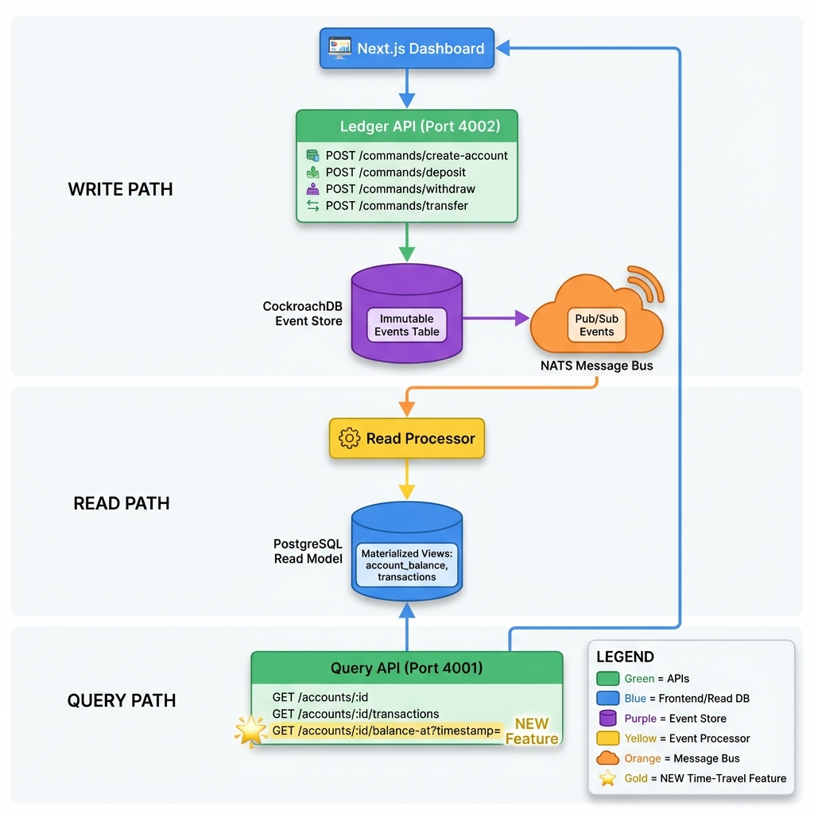
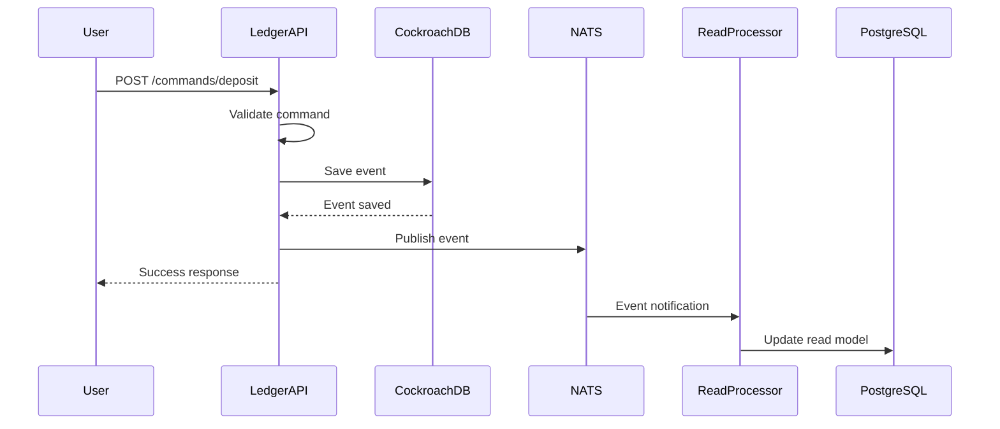
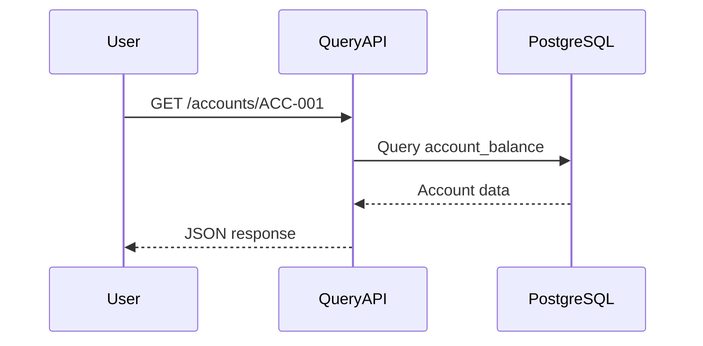
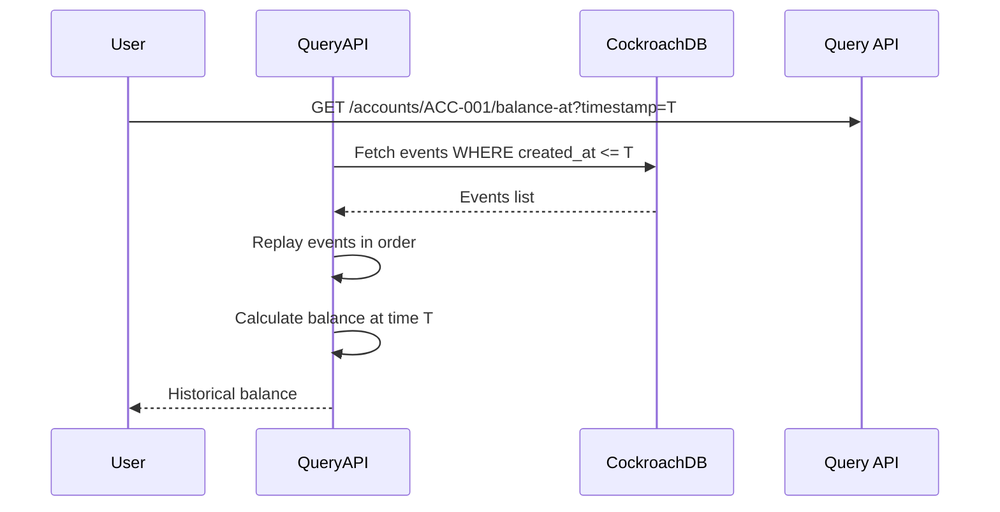

# Chronicle Ledger - Architecture

> Modern Event-Sourced Banking System using CQRS, CockroachDB, PostgreSQL, and NATS

---

## 🏗️ High-Level Design

### System Overview

Chronicle Ledger implements Event Sourcing and CQRS patterns to provide:
- **Complete audit trail** - Every state change is recorded as an immutable event
- **Time-travel queries** - Query account state at any point in history
- **Scalable architecture** - Separate read/write paths for independent scaling

### Architecture Diagram



---

## 📊 System Components

### 1. **Event Store (CockroachDB)**
- **Purpose:** Immutable event log - source of truth
- **Port:** 26257
- **Table:** `events`
  - event_id (UUID)
  - aggregate_id (Account ID)
  - event_type (AccountCreated, MoneyDeposited, etc.)
  - event_data (JSONB payload)
  - created_at (TIMESTAMP)

### 2. **Message Bus (NATS)**
- **Purpose:** Event distribution
- **Port:** 4222 (client), 8222 (monitoring)
- **Topics:**
  - `events.account.created`
  - `events.account.deposited`
  - `events.account.withdrawn`

### 3. **Read Model (PostgreSQL)**
- **Purpose:** Optimized for queries
- **Port:** 5433
- **Tables:**
  - `account_balance` - Current account states
  - `transactions` - Transaction history
  - `transfers` - Transfer tracking

### 4. **Ledger API** (Write Service)
- **Purpose:** Handle commands
- **Port:** 4002
- **Endpoints:**
  - POST `/commands/create-account`
  - POST `/commands/deposit`
  - POST `/commands/withdraw`
  - POST `/commands/transfer`

### 5. **Query API** (Read Service)
- **Purpose:** Handle queries
- **Port:** 4001
- **Endpoints:**
  - GET `/accounts/:id`
  - GET `/accounts/:id/balance-at?timestamp=X` (Time-travel!)
  - GET `/accounts/:id/transactions`
  - GET `/events`

### 6. **Read Processor**
- **Purpose:** Event consumer - updates read model
- **Listens to:** NATS events
- **Updates:** PostgreSQL read model tables

### 7. **Dashboard**
- **Purpose:** Web UI
- **Port:** 3000
- **Features:**
  - Real-time event stream
  - Account management
  - Transfer operations
  - Audit log viewer

---

## 🔄 Data Flow

### Write Path (Commands)



### Read Path (Queries)



### Time-Travel Query



---

## 🎯 CQRS Pattern

**Command Side (Writes)**
- Ledger API validates commands
- Creates immutable events
- Saves to CockroachDB
- Publishes to NATS

**Query Side (Reads)**
- Query API reads from PostgreSQL
- Fast lookups (indexed)
- Materialized views
- Time-travel via event replay

**Benefits:**
- Independent scaling
- Optimized for each use case
- Clear separation of concerns
- Eventual consistency

---

## 💾 Database Schema

### CockroachDB - Event Store

**Table: `events`**
```sql
CREATE TABLE events (
  event_id UUID PRIMARY KEY,
  aggregate_id VARCHAR(255) NOT NULL,
  aggregate_type VARCHAR(100) NOT NULL,
  event_type VARCHAR(100) NOT NULL,
  event_data JSONB NOT NULL,
  event_version INT DEFAULT 1,
  created_at TIMESTAMPTZ DEFAULT NOW(),
  INDEX idx_aggregate (aggregate_id, created_at),
  INDEX idx_event_type (event_type, created_at)
);
```

### PostgreSQL - Read Model

**Table: `account_balance`**
```sql
CREATE TABLE account_balance (
  account_id VARCHAR(255) PRIMARY KEY,
  owner_name VARCHAR(255) NOT NULL,
  balance DECIMAL(18,2) NOT NULL DEFAULT 0,
  currency VARCHAR(3) NOT NULL DEFAULT 'USD',
  status VARCHAR(50) DEFAULT 'active',
  created_at TIMESTAMPTZ DEFAULT NOW(),
  last_updated TIMESTAMPTZ DEFAULT NOW()
);
```

**Table: `transactions`**
```sql
CREATE TABLE transactions (
  transaction_id UUID PRIMARY KEY,
  account_id VARCHAR(255) REFERENCES account_balance(account_id),
  type VARCHAR(50) NOT NULL,
  amount DECIMAL(18,2) NOT NULL,
  balance_after DECIMAL(18,2) NOT NULL,
  description TEXT,
  timestamp TIMESTAMPTZ DEFAULT NOW()
);
```

**Table: `transfers`**
```sql
CREATE TABLE transfers (
  transfer_id UUID PRIMARY KEY,
  from_account_id VARCHAR(255),
  to_account_id VARCHAR(255),
  amount DECIMAL(18,2) NOT NULL,
  description TEXT,
  status VARCHAR(50) DEFAULT 'completed',
  created_at TIMESTAMPTZ DEFAULT NOW()
);
```

---

## 📡 API Contracts

### Create Account
```http
POST /commands/create-account
Content-Type: application/json

{
  "account_id": "ACC-001",
  "owner_name": "John Doe",
  "initial_balance": 1000,
  "currency": "USD"
}

Response: { "success": true, "event_id": "uuid" }
```

### Deposit Money
```http
POST /commands/deposit
Content-Type: application/json

{
  "account_id": "ACC-001",
  "amount": 500,
  "description": "Salary"
}

Response: { "success": true, "event_id": "uuid" }
```

### Transfer Money
```http
POST /commands/transfer
Content-Type: application/json

{
  "from_account_id": "ACC-001",
  "to_account_id": "ACC-002",
  "amount": 200,
  "description": "Payment"
}

Response: { 
  "success": true, 
  "transfer_id": "uuid",
  "events": [...]
}
```

### Query Account
```http
GET /accounts/ACC-001

Response: {
  "account_id": "ACC-001",
  "owner_name": "John Doe",
  "balance": "1300.00",
  "currency": "USD",
  "status": "active"
}
```

### Time-Travel Query (⭐ Star Feature)
```http
GET /accounts/ACC-001/balance-at?timestamp=2026-01-01T10:00:00Z

Response: {
  "account_id": "ACC-001",
  "balance": "1000.00",
  "at": "2026-01-01T10:00:00Z"
}
```

---

## 🚀 Deployment

### Infrastructure (Docker Compose)
```yaml
services:
  postgres:      # Read Model
  cockroach:     # Event Store
  nats:          # Message Bus
```

### Application Services
```bash
npm run dev   # Starts all services:
  - Ledger API (4002)
  - Query API (4001)
  - Read Processor
  - Dashboard (3000)
```

---

## ⚡ Performance Characteristics

### Write Operations
- Event append: ~10ms (CockroachDB)
- NATS publish: ~2ms
- Total write: ~12ms

### Read Operations
- Direct query: ~5ms (PostgreSQL)
- Time-travel: ~50ms (event replay)

### Scalability
- Ledger API: Horizontal scaling (stateless)
- Query API: Horizontal scaling + read replicas
- Read Processor: Multiple consumers on same topic
- Event Store: CockroachDB distributed architecture

---

## 🔒 Design Patterns

### 1. Event Sourcing
- Append-only event log
- State derived from events
- Complete audit trail
- Time-travel capabilities

### 2. CQRS
- Separate read/write models
- Independent optimization
- Eventual consistency
- Scalable architecture

### 3. Event-Driven Architecture
- Loose coupling via NATS
- Async processing
- Pub/sub pattern
- Resilient to failures

---

## 🎯 Key Benefits

1. **Audit Trail** - Every change is recorded
2. **Time-Travel** - Query historical state
3. **Debugging** - Replay events to reproduce bugs
4. **Compliance** - Immutable log for audits
5. **Scalability** - Independent scaling of read/write
6. **Analytics** - Historical data without snapshots

---

**Built with:** Event Sourcing • CQRS • CockroachDB • PostgreSQL • NATS • Next.js
