# 📚 Event Sourcing Deep Dive
## Understanding Immutable Event Logs

---

## 🎯 What is Event Sourcing?

**Traditional Approach (State-Based):**
```
Database stores CURRENT state:
account_balance = 1000
```

**Event Sourcing Approach (Fact-Based):**
```
Database stores IMMUTABLE events:
1. AccountCreated(initial: 0)
2. Deposited(+500)
3. Deposited(+500)

Current state = reduce(events) = 1000
```

---

## 🎬 Visual Comparison

### Traditional CRUD vs Event Sourcing


---

## 💼 Real-World Use Cases

### 1. Banking & Financial Systems
**Why:** Regulatory compliance requires complete audit trail

```javascript
// Auditor asks: "Show me all transactions on account ACC-001 in January 2024"
const events = await eventStore.query({
  aggregate_id: 'account:ACC-001',
  from: '2024-01-01',
  to: '2024-01-31'
});

// Returns EVERY event - nothing is lost!
```

### 2. E-Commerce Order Management
**Why:** Track order lifecycle for customer support

```javascript
Order Events:
1. OrderCreated { items: [item1, item2] }
2. PaymentReceived { amount: 100 }
3. OrderShipped { tracking: "ABC123" }
4. OrderDelivered { timestamp: "2024-01-15" }

// Customer calls: "Where's my order?"
// Support can see EXACT history!
```

### 3. Medical Records
**Why:** Legal requirement to preserve all diagnoses/treatments

```javascript
Patient Events:
1. Diagnosed { condition: "Flu" }
2. PrescribedMedication { drug: "Tamiflu" }
3. FollowUpScheduled { date: "2024-02-01" }

// Cannot delete or modify - permanent record
```

---

## 🔄 Event Sourcing Workflow


---

## ✅ Benefits of Event Sourcing

### 1. Complete Audit Trail
```javascript
// Traditional: Lost information
Before: balance = 500
After: balance = 1000
Question: How did it change? 🤷‍♂️

// Event Sourcing: Complete story
Event 1: Deposited(+300) at 10:00 AM by user:123
Event 2: Deposited(+200) at 10:05 AM by user:456
Question: How did it change? ✅ Full answer!
```

### 2. Time Travel Debugging
```javascript
// "The balance was wrong at 2 PM yesterday"
const balanceAt2PM = await replayEvents({
  aggregate_id: 'account:ACC-001',
  until: '2024-01-15T14:00:00Z'
});

// Replay events up to that point → Reproduce bug!
```

### 3. Multiple Read Models
```javascript
// Same events can build different views
Events: [OrderCreated, ItemAdded, ItemAdded, OrderShipped]

Read Model 1: Current Order Status
{ order_id: "ORD-1", status: "shipped", items: 2 }

Read Model 2: Shipping Analytics
{ total_shipped_today: 150 }

Read Model 3: Inventory Depleted
{ item_id: "SKU-123", remaining: 5 }
```

### 4. Business Intelligence
```javascript
// ML model for fraud detection
const allTransactions = await eventStore.replay({
  event_types: ['MoneyDeposited', 'MoneyWithdrawn'],
  from: '2023-01-01'
});

trainModel(allTransactions);
```

---

## ⚠️ Challenges & Solutions

### Challenge 1: Schema Evolution

**Problem:** Events written 6 months ago have old schema

```javascript
// v1 (Old Event)
{
  event_type: "MoneyDeposited",
  event_version: 1,
  amount: 500
}

// v2 (New Event)
{
  event_type: "MoneyDeposited",
  event_version: 2,
  amount: 500,
  currency: "USD"  // New field!
}
```

**Solution: Upcasting**
```javascript
function upcastEvent(event) {
  if (event.event_version === 1) {
    return {
      ...event,
      currency: 'USD',  // Default for old events
      event_version: 2
    };
  }
  return event;
}
```

**Rules:**
- ✅ Only ADD optional fields (backward compatible)
- ❌ Never REMOVE fields (breaks old events)
- ✅ Version every event

---

### Challenge 2: Storage Growth

**Problem:** Events are never deleted → Infinite growth

**Solution 1: Snapshots**
```javascript
// Instead of replaying 1 million events every time...
Snapshot (every 1000 events):
{
  aggregate_id: "account:ACC-001",
  version: 1000,
  state: { balance: 5000 }
}

// Replay only events AFTER snapshot (events 1001-1050)
```

**Solution 2: Archiving**
```javascript
// Move old events to cold storage
if (event.created_at < '2023-01-01') {
  archiveToS3(event);
  deleteFromHotStorage(event);
}
```

---

### Challenge 3: Eventual Consistency

**Problem:** Read model lags behind events

```mermaid
sequenceDiagram
    participant Client
    participant WriteAPI
    participant EventStore
    participant EventBus
    participant ReadDB
    
    Client->>WriteAPI: Deposit $500
    WriteAPI->>EventStore: Store Event
    WriteAPI-->>Client: 201 Created ✅
    
    Note over Client: Client immediately queries balance
    
    Client->>ReadDB: GET balance
    ReadDB-->>Client: $1000 (OLD!) ❌
    
    Note over EventBus: 50ms later...
    
    EventBus->>ReadDB: Update balance → $1500
```



**Solution 1: Accept It (Most Cases)**
```javascript
// 95% of apps can tolerate 100ms lag
// User refreshes page → sees updated balance
```

**Solution 2: Read-Your-Writes**
```javascript
// Write returns event ID
POST /deposit → { event_id: "evt-123" }

// Client polls until materialized
GET /events/evt-123/status
→ { materialized: true } ✅

// Now safe to read
GET /balance → $1500
```

**Solution 3: Query Event Store Directly**
```javascript
// For critical reads, skip read model
GET /balance?source=event_store
→ Always returns latest (slower, but accurate)
```

---

## 🏗️ Event Store Design

### Core Schema

```sql
CREATE TABLE events (
    event_id UUID PRIMARY KEY,
    aggregate_id VARCHAR(255),      -- Entity this event belongs to
    aggregate_type VARCHAR(50),     -- e.g. "Account"
    event_type VARCHAR(100),        -- e.g. "MoneyDeposited"
    event_data JSONB,               -- Event payload
    event_version INT DEFAULT 1,    -- Schema version
    created_at TIMESTAMP,
    created_by VARCHAR(255),        -- User/System ID
    
    -- Indexes for fast queries
    INDEX idx_aggregate (aggregate_id, created_at)
);
```

### Event Structure

```typescript
interface Event {
  event_id: string;
  aggregate_id: string;        // "account:ACC-001"
  aggregate_type: string;      // "Account"
  event_type: string;          // "MoneyDeposited"
  event_data: {
    amount: number;
    description?: string;
  };
  event_version: number;       // 1
  created_at: Date;
  created_by: string;          // "user:123"
  metadata?: {
    correlation_id?: string;  // Link related events
    ip_address?: string;
  };
}
```

---

## 🎨 Event Design Patterns

### Pattern 1: Aggregate Root

**Concept:** Events belong to an aggregate (e.g., Account)

```javascript
// Good: Events scoped to aggregate
{
  aggregate_id: "account:ACC-001",
  event_type: "MoneyDeposited",
  event_data: { amount: 500 }
}

// Bad: Global events (hard to replay)
{
  event_type: "SomethingHappened",
  event_data: { ... }
}
```

---

### Pattern 2: Event Enrichment

**Concept:** Include all data needed to process event

```javascript
// Bad: Requires lookup
{
  event_type: "OrderPlaced",
  event_data: {
    user_id: "user-123"  // Need to query user table!
  }
}

// Good: Self-contained
{
  event_type: "OrderPlaced",
  event_data: {
    user_id: "user-123",
    user_email: "john@example.com",  // ✅ Enriched!
    user_tier: "premium"
  }
}
```

---

### Pattern 3: Correlation ID

**Concept:** Link events from same user action

```javascript
// User creates order → 3 events generated
{
  event_type: "OrderCreated",
  metadata: { correlation_id: "corr-123" }
}
{
  event_type: "InventoryReserved",
  metadata: { correlation_id: "corr-123" }
}
{
  event_type: "PaymentProcessed",
  metadata: { correlation_id: "corr-123" }
}

// Track entire flow!
```

---

## 🔄 Event Replay (The Superpower)

### Use Case 1: Rebuild Read Model

```javascript
async function rebuildReadModel() {
  // Clear current state
  await db.query('TRUNCATE account_balance');
  
  // Replay ALL events
  const events = await eventStore.fetchAll();
  
  for (const event of events) {
    await handleEvent(event);  // Rebuild state
  }
}
```

### Use Case 2: Create New Projection

```javascript
// New requirement: "Show daily transaction summary"
// Don't need to track new events - just replay existing!

async function buildDailySummary() {
  const events = await eventStore.fetchAll();
  
  const summary = {};
  for (const event of events) {
    const date = event.created_at.toISOString().split('T')[0];
    if (!summary[date]) summary[date] = { deposits: 0, withdrawals: 0 };
    
    if (event.event_type === 'MoneyDeposited') {
      summary[date].deposits += event.event_data.amount;
    }
  }
  
  await saveSummary(summary);
}
```

---

## 🎯 When to Use Event Sourcing

### ✅ Use When:
- Need complete audit trail (banking, medical)
- Regulatory compliance requirements
- Complex business logic with many state transitions
- Want time-travel debugging
- Multiple teams need different views of same data

### ❌ Don't Use When:
- Simple CRUD app (over-engineering)
- Short-lived data (cache, session)
- Performance is critical (replay overhead)
- Team unfamiliar with pattern (learning curve)

---

## 🎓 Key Takeaways

1. **Events are Facts**: Immutable, append-only
2. **State is Derived**: Computed from events
3. **Complete History**: Never lose data
4. **Eventual Consistency**: Read model lags slightly
5. **Schema Evolution**: Version events carefully
6. **Replay Power**: Rebuild state anytime

---

## 📖 Further Reading

- [Martin Fowler - Event Sourcing](https://martinfowler.com/eaaDev/EventSourcing.html)
- [Greg Young - CQRS & Event Sourcing](https://www.youtube.com/watch?v=JHGkaShoyNs)
- [EventStoreDB Documentation](https://www.eventstore.com/event-sourcing)

---

**Next:** See [LINEARIZABILITY.md](./LINEARIZABILITY.md) for consistency guarantees.
