```mermaid
graph LR
    A[Ledger API] -->|Write Event| B[CockroachDB]
    B -.->|Publish Fails| C[NATS ❌]
    
    D[Read Processor] -.->|Cannot Subscribe| C
    E[PostgreSQL Read Model] -->|Stale Data| F[Query API]
    
    style C fill:#f66,stroke:#333
    style E fill:#ff9,stroke:#333
```

# ⚠️ Failure Scenarios & Chaos Testing
## ChronicleLedger - "What If Everything Breaks?"

---

## 🎯 Purpose

This document proves **Senior Engineering Maturity** by answering:
- "What happens when X fails?"
- "How does the system recover?"
- "What's the blast radius of failures?"

**Interview Signal**: Junior engineers build features. **Senior engineers design for failure.**

---

## 📋 Failure Catalog

### Failure Matrix

| Component | Failure Mode | Impact | Recovery Time | Mitigation |
|-----------|-------------|--------|---------------|------------|
| CockroachDB Node 1 | Crash | ✅ None (2/3 quorum) | Instant | Raft leader election |
| CockroachDB Node 2 | Crash | ✅ None (2/3 quorum) | Instant | Continue with 2 nodes |
| CockroachDB 2+ Nodes | Crash | 🔴 Write Unavailable | Manual restart | Deploy 5-node cluster |
| NATS | Crash | 🟡 Read lag | Instant (events in DB) | Persistent queue (JetStream) |
| PostgreSQL | Crash | 🟡 Read unavailable | Manual restart | Add read replica |
| Ledger API | Crash | 🟡 Writes unavailable | Load balancer failover | Deploy 2+ instances |
| Read Processor | Crash | 🟡 Read lag increases | Auto-restart | Idempotent event handling |
| Network Partition | Split brain | 🟡 Depends on partition | Automatic (Raft) | Network redundancy |

---

## 🧪 Test Scenarios

### Scenario 1: CockroachDB Node Failure (THE DEMO)

**Setup:**
```bash
# Start all services
docker-compose up -d

# Verify 3-node cluster
docker exec -it cockroach1 ./cockroach node status --insecure
```

**Expected Output:**
```
  id |     address     |  build  |    started_at    | is_live
-----+-----------------+---------+------------------+---------
   1 | cockroach1:26257| v23.1.0 | 2026-01-15 10:00 |  true
   2 | cockroach2:26257| v23.1.0 | 2026-01-15 10:00 |  true
   3 | cockroach3:26257| v23.1.0 | 2026-01-15 10:00 |  true
```

---

**Test Step 1: Write Under Normal Conditions**
```bash
# Create account
curl -X POST http://localhost:4000/api/v1/commands/create-account \
  -H "Content-Type: application/json" \
  -d '{
    "account_id": "DEMO-001",
    "owner_name": "Test User",
    "initial_balance": 1000.00,
    "currency": "USD"
  }'
```

**Expected:** ✅ `201 Created` with event ID

---

**Test Step 2: Kill Node 2 Mid-Transaction**
```bash
# Terminal 1: Start continuous writes
npm run simulate:continuous

# Terminal 2: Kill node 2 after 5 seconds
sleep 5 && docker stop cockroach2
```

**Expected Behavior:**


```mermaid
sequenceDiagram
    participant Client
    participant LedgerAPI
    participant Node1 as CockroachDB Node 1 (Leader)
    participant Node2 as CockroachDB Node 2 ❌
    participant Node3 as CockroachDB Node 3
    
    Client->>LedgerAPI: POST /commands/deposit
    LedgerAPI->>Node1: BEGIN TRANSACTION
    Node1->>Node2: Replicate (timeout)
    Node1->>Node3: Replicate (ACK ✅)
    
    Note over Node1: 2/3 Quorum Achieved!
    
    Node1-->>LedgerAPI: COMMIT SUCCESS
    LedgerAPI-->>Client: 201 Created ✅
```

**Verification:**
```bash
# Check cluster status (Node 2 should be dead)
docker exec -it cockroach1 ./cockroach node status --insecure

# Writes should STILL succeed
curl -X POST http://localhost:4000/api/v1/commands/deposit \
  -H "Content-Type: application/json" \
  -d '{"account_id": "DEMO-001", "amount": 500.00}'
```

**Expected:** ✅ `201 Created` (writes continue!)

---

**Test Step 3: Restart Node 2 (Self-Healing)**
```bash
docker start cockroach2

# Wait 10 seconds for rejoin
sleep 10

# Check cluster status
docker exec -it cockroach1 ./cockroach node status --insecure
```

**Expected:**
- Node 2 rejoins cluster
- Replicates missed events via Raft log
- No data loss

**Proof of Linearizability:**
```bash
# Query transaction count from all 3 nodes
docker exec -it cockroach1 ./cockroach sql --insecure \
  -e "SELECT COUNT(*) FROM events;"

docker exec -it cockroach2 ./cockroach sql --insecure \
  -e "SELECT COUNT(*) FROM events;"

docker exec -it cockroach3 ./cockroach sql --insecure \
  -e "SELECT COUNT(*) FROM events;"
```

**Expected:** All 3 nodes return **same count** (strict consistency)

---

### Scenario 2: NATS Message Bus Failure

**Setup:**
```bash
# Start normal traffic
npm run simulate:continuous
```

**Test:**
```bash
# Kill NATS
docker stop nats

# Check impact
curl http://localhost:4001/api/v1/accounts/DEMO-001/balance
```

**Expected Behavior:**



**Impact:**
- ✅ **Writes**: Still succeed (events in CockroachDB)
- 🟡 **Reads**: Serve stale data (PostgreSQL not updated)
- 🟡 **Lag**: Read model falls behind

**Mitigation Strategy:**
```javascript
// Ledger API: Store event in DB even if NATS publish fails
async function handleDeposit(command) {
  const event = await db.insertEvent(command);  // ✅ Persisted
  
  try {
    await nats.publish('events.account.deposited', event);
  } catch (err) {
    logger.warn('NATS publish failed, event safely in DB', {event_id: event.id});
    // Read processor will catch up when NATS recovers
  }
  
  return event;
}
```

**Recovery:**
```bash
# Restart NATS
docker start nats

# Read processor auto-reconnects and processes backlog
```

---

### Scenario 3: PostgreSQL Read Model Corruption

**Setup:**
```bash
# Corrupt the read model
docker exec -it postgres psql -U postgres -d chronicle \
  -c "UPDATE account_balance SET balance = 9999999 WHERE account_id = 'DEMO-001';"
```

**Impact:**
- Query API returns wrong balance
- Event store is still correct (source of truth)

**Recovery - Rebuild from Events:**
```bash
# Truncate corrupted read model
docker exec -it postgres psql -U postgres -d chronicle \
  -c "TRUNCATE account_balance, transactions CASCADE;"

# Replay all events
npm run rebuild:read-model
```

**Rebuild Script (read-processor/rebuild.js):**
```javascript
async function rebuildReadModel() {
  console.log('🔄 Rebuilding read model from events...');
  
  // Fetch all events from CockroachDB (source of truth)
  const events = await cockroachDB.query(
    'SELECT * FROM events ORDER BY created_at ASC'
  );
  
  for (const event of events.rows) {
    // Replay each event
    await handleEvent(event);
  }
  
  console.log(`✅ Rebuilt ${events.rowCount} events`);
}
```

**Proof:**
```bash
# Balance should be correct again
curl http://localhost:4001/api/v1/accounts/DEMO-001/balance
```

---

### Scenario 4: Network Partition (Split Brain)

**Setup:**
```bash
# Simulate network partition using iptables
docker exec -it cockroach2 iptables -A INPUT -s cockroach1 -j DROP
docker exec -it cockroach2 iptables -A INPUT -s cockroach3 -j DROP
```

**Expected Behavior:**
```
Partition 1: [Node 1, Node 3]  → 2/3 Majority → ✅ Accepts writes
Partition 2: [Node 2]          → 1/3 Minority → ❌ Rejects writes
```

**Raft Protocol Guarantees:**
- Only partition with **majority** can commit
- Node 2 becomes follower (no leader election)
- **No split-brain** (distributed consensus)

**Test:**
```bash
# Write should succeed (routed to Node 1 or 3)
curl -X POST http://localhost:4000/api/v1/commands/deposit \
  -d '{"account_id": "DEMO-001", "amount": 100.00}'
```

**Recovery:**
```bash
# Remove network partition
docker exec -it cockroach2 iptables -F

# Node 2 catches up via Raft log
```

---

### Scenario 5: Concurrent Writes (Race Condition)

**Problem:** Two clients try to withdraw from same account simultaneously

**Setup:**
```bash
# Account has $100
# Client A: Withdraw $80
# Client B: Withdraw $80
# Expected: One succeeds, one fails (balance can't go negative)
```

**Without Proper Locking:**

```mermaid
sequenceDiagram
    participant ClientA
    participant ClientB
    participant LedgerAPI
    participant DB
    
    ClientA->>LedgerAPI: Withdraw $80
    ClientB->>LedgerAPI: Withdraw $80
    
    LedgerAPI->>DB: Read balance = $100 ✅
    LedgerAPI->>DB: Read balance = $100 ✅
    
    LedgerAPI->>DB: Write balance = $20 ❌ 
    LedgerAPI->>DB: Write balance = $20 ❌
    
    Note over DB: Lost Update! Account now -$60
```


**Solution 1: Optimistic Locking**
```sql
-- Check version before update
UPDATE aggregate_versions 
SET current_version = current_version + 1
WHERE aggregate_id = 'account:DEMO-001' 
  AND current_version = 5;  -- Expected version

-- If 0 rows affected → concurrent write detected → ROLLBACK
```

**Solution 2: Pessimistic Locking**
```sql
BEGIN TRANSACTION;
SELECT balance FROM account_balance 
WHERE account_id = 'DEMO-001' 
FOR UPDATE;  -- Lock row

-- Perform business logic
UPDATE account_balance SET balance = balance - 80;
COMMIT;
```

**Test Script:**
```bash
npm run test:concurrent-withdrawals
```

**Expected:** One request gets `201 Created`, other gets `409 Conflict`

---

### Scenario 6: Event Schema Evolution

**Problem:** Events written 6 months ago have old schema

**Example:**
```javascript
// v1 (Jan 2026)
{
  "event_type": "MoneyDeposited",
  "event_version": 1,
  "event_data": {
    "amount": 500.00
  }
}

// v2 (July 2026) - Added currency field
{
  "event_type": "MoneyDeposited",
  "event_version": 2,
  "event_data": {
    "amount": 500.00,
    "currency": "USD"
  }
}
```

**Solution: Version-Aware Event Handler**
```javascript
function handleMoneyDeposited(event) {
  let { amount, currency } = event.event_data;
  
  // Upcast old events
  if (event.event_version === 1) {
    currency = 'USD';  // Default for old events
  }
  
  // Process with normalized data
  await updateBalance(event.aggregate_id, amount, currency);
}
```

**Rules:**
- ✅ **Additive Changes Only**: Add new optional fields
- ❌ **Never Remove Fields**: Breaks old events
- ✅ **Version Everything**: Include `event_version`

---

## 🎯 Chaos Testing Checklist

Use this checklist during interviews or demos:

### High Availability
- [ ] Kill 1 CockroachDB node → Writes continue
- [ ] Kill 2 CockroachDB nodes → Writes fail gracefully
- [ ] Restart killed node → Data syncs automatically

### Data Integrity
- [ ] Concurrent withdrawals → No overdrafts
- [ ] Network partition → No split-brain
- [ ] Read model corruption → Rebuild from events

### Observability
- [ ] All failures logged with severity
- [ ] Metrics show degraded state
- [ ] Alerts triggered (email/Slack)

### Recovery
- [ ] NATS restart → Read processor catches up
- [ ] PostgreSQL restart → Serves last known state
- [ ] Full system restart → All data intact

---

## 📊 Failure Modes Summary

```mermaid
graph TB
    subgraph "Acceptable Degradation"
        A1[Single Node Failure] -->|2/3 Quorum| A2[✅ Writes Continue]
        B1[NATS Failure] -->|Events in DB| B2[🟡 Read Lag]
        C1[Read Processor Down] -->|Temp Delay| C2[🟡 Stale Reads]
    end
    
    subgraph "Critical Failures"
        D1[2+ DB Nodes Down] -->|No Quorum| D2[❌ Writes Blocked]
        E1[PostgreSQL Down] -->|No Cache| E2[❌ Reads Blocked]
    end
    
    subgraph "Recovery Strategies"
        F1[Auto Restart] --> A2
        F2[Event Replay] --> B2
        F3[Manual Intervention] --> D2
    end
```



---

## 🎤 Interview Talking Points

**Q: "What happens if your database crashes?"**

> **A**: "ChronicleLedger uses a 3-node CockroachDB cluster with Raft consensus. If one node crashes, the other two form a quorum and continue accepting writes with zero downtime. I can demonstrate this live—I'll kill node 2 mid-transaction, and you'll see writes still succeed. When the node restarts, Raft automatically syncs it via log replication. For total cluster failure, all events are already persisted, so we just restart and replay."

**Q: "How do you handle eventual consistency?"**

> **A**: "I use CQRS. The write side (CockroachDB) is strongly consistent—strict serializability via Raft. The read side (PostgreSQL) is eventually consistent, typically lagging 10-50ms. For most queries, this is fine. For critical reads that need linearizability, I query the event store directly. I also include a 'read-your-writes' pattern where the write response includes the event ID, and clients can poll until it's materialized."

---

**Next Steps**: See [INTERVIEW.md](./INTERVIEW.md) for common interview questions and answers.
