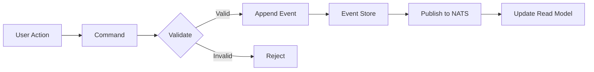
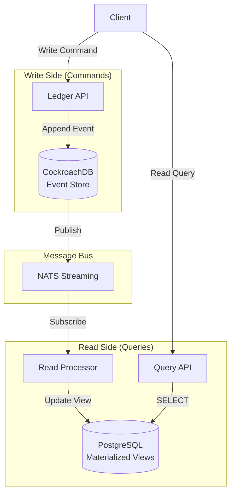
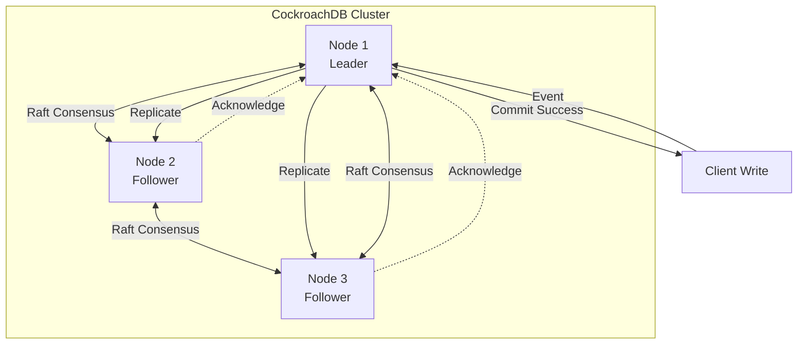
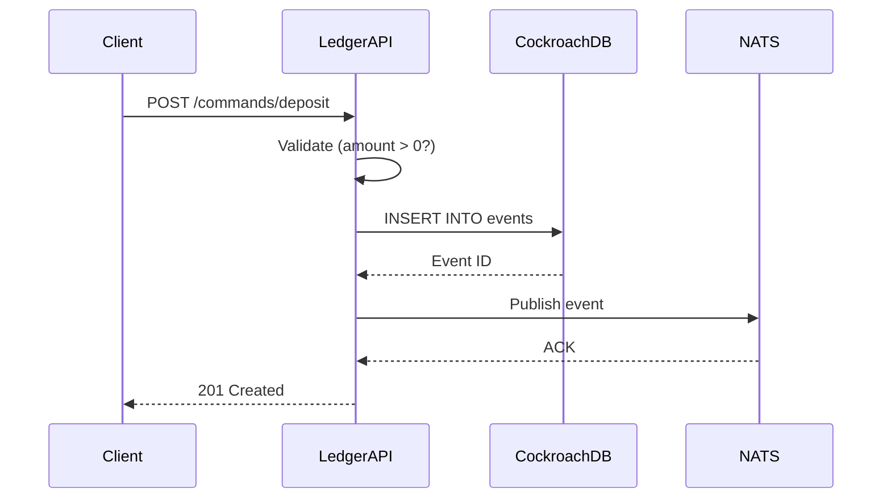
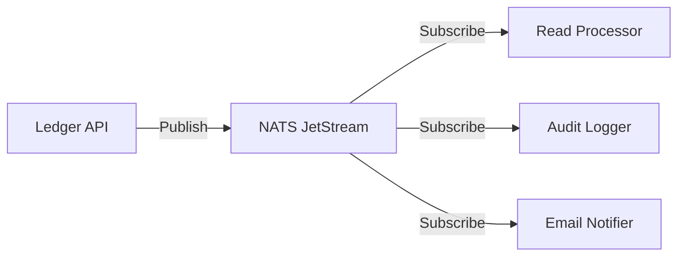
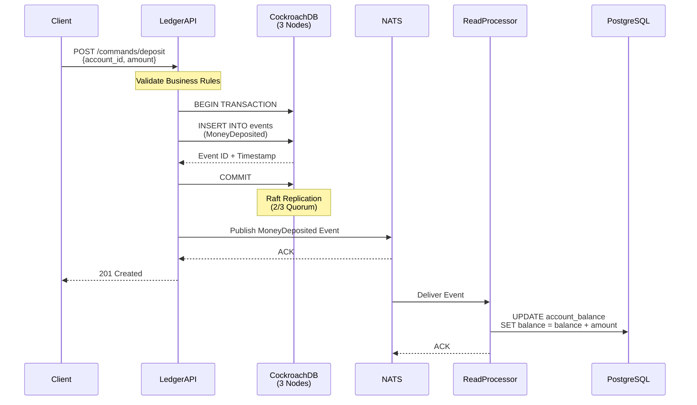
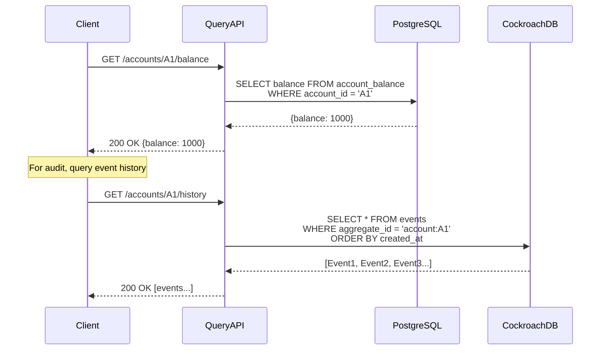
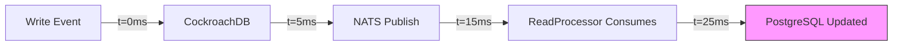
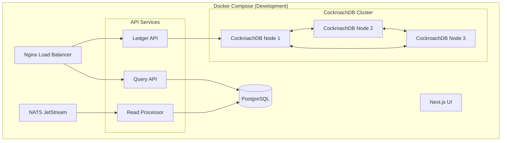

# 🏗️ High-Level Design (HLD)
## ChronicleLedger - Immutable Audit Ledger

---

## 📋 Table of Contents
1. [System Overview](#system-overview)
2. [Architecture Principles](#architecture-principles)
3. [Component Design](#component-design)
4. [Data Flow](#data-flow)
5. [Technology Decisions](#technology-decisions)
6. [Scalability & Performance](#scalability--performance)
7. [Trade-offs & Constraints](#trade-offs--constraints)

---

## 1. System Overview

### Purpose
ChronicleLedger is a **distributed immutable audit ledger** that proves mastery of:
- Event Sourcing architecture
- Distributed consensus (Raft protocol via CockroachDB)
- High availability and linearizability
- CQRS (Command Query Responsibility Segregation)

### Core Principle
**"State is Derived, Events are Truth"**

Instead of storing current state (e.g., `account_balance = 1000`), we store immutable events:
```
Event 1: AccountCreated { account_id: "A1", initial_balance: 0 }
Event 2: MoneyDeposited { account_id: "A1", amount: 500 }
Event 3: MoneyDeposited { account_id: "A1", amount: 500 }

Current Balance = SUM(events) = 1000
```

---

## 2. Architecture Principles

### 2.1 Event Sourcing


**Benefits:**
- ✅ Complete audit trail (who, what, when)
- ✅ Time-travel debugging (replay to any point)
- ✅ Regulatory compliance (immutable history)
- ✅ No lost data (only append, never update/delete)

**Trade-offs:**
- ❌ More complex read queries (must aggregate events)
- ❌ Storage growth (solved by snapshotting)
- ❌ Event schema evolution (solved by versioning)

---

### 2.2 CQRS (Command Query Responsibility Segregation)



**Why Separation?**
- Write model optimized for **consistency** (CockroachDB with Raft)
- Read model optimized for **speed** (PostgreSQL with indexes)
- Scales independently (10:1 read-to-write ratio typical)

---

## 3. Component Design

### 3.1 CockroachDB Cluster (Event Store)



**Key Properties:**
- **3-Node Cluster**: Quorum requires 2/3 nodes (tolerates 1 failure)
- **Raft Protocol**: Leader election + log replication
- **Strict Serializability**: Linearizable reads/writes
- **Horizontal Scaling**: Add nodes without downtime

**Event Schema:**
```sql
CREATE TABLE events (
    event_id UUID PRIMARY KEY DEFAULT gen_random_uuid(),
    aggregate_id VARCHAR(255) NOT NULL,     -- e.g., "account:A1"
    aggregate_type VARCHAR(50) NOT NULL,    -- e.g., "Account"
    event_type VARCHAR(100) NOT NULL,       -- e.g., "MoneyDeposited"
    event_data JSONB NOT NULL,              -- Payload
    event_version INT NOT NULL DEFAULT 1,   -- Schema version
    created_at TIMESTAMP DEFAULT NOW(),
    created_by VARCHAR(255),                -- User/System ID
    metadata JSONB,                         -- Correlation IDs, IP, etc.
    INDEX idx_aggregate (aggregate_id, created_at)
);
```

---

### 3.2 Ledger API (Write Service)

**Responsibilities:**
1. Validate commands (business rules)
2. Append events to CockroachDB
3. Publish events to NATS



**Tech Stack:**
- Node.js (Fastify for performance)
- `pg` driver for CockroachDB
- `nats` client

**APIs:**
```
POST /commands/create-account
POST /commands/deposit
POST /commands/withdraw
POST /commands/transfer
```

---

### 3.3 NATS Message Bus

**Why NATS over Kafka?**
- ✅ Lightweight (40MB vs 1GB+ JVM)
- ✅ At-least-once delivery with JetStream
- ✅ Subject-based routing (flexible fan-out)
- ❌ No long-term retention (solved by Event Store)



**Stream Configuration:**
```
Stream: chronicle-events
Subjects: events.account.*, events.user.*
Retention: Limits (max 10M events, 7 days)
```

---

### 3.4 Read Processor (Materializer)

**Responsibilities:**
1. Subscribe to NATS events
2. Rebuild current state from events
3. Update PostgreSQL read model

```javascript
// Pseudo-code
nats.subscribe('events.account.*', async (msg) => {
  const event = JSON.parse(msg.data);
  
  switch (event.event_type) {
    case 'MoneyDeposited':
      await db.query(
        'UPDATE account_balance SET balance = balance + $1 WHERE id = $2',
        [event.event_data.amount, event.aggregate_id]
      );
      break;
    case 'MoneyWithdrawn':
      await db.query(
        'UPDATE account_balance SET balance = balance - $1 WHERE id = $2',
        [event.event_data.amount, event.aggregate_id]
      );
      break;
  }
  
  msg.ack();
});
```

**PostgreSQL Read Model:**
```sql
CREATE TABLE account_balance (
    account_id VARCHAR(255) PRIMARY KEY,
    balance NUMERIC(20, 2) NOT NULL,
    last_updated TIMESTAMP DEFAULT NOW()
);

CREATE TABLE account_transactions (
    transaction_id UUID PRIMARY KEY,
    account_id VARCHAR(255),
    type VARCHAR(50),
    amount NUMERIC(20, 2),
    timestamp TIMESTAMP
);
```

---

### 3.5 Query API (Read Service)

**Responsibilities:**
1. Serve fast queries from materialized views
2. Provide event history for audit

```
GET /accounts/{id}/balance          → Current state (fast)
GET /accounts/{id}/history           → All events (audit)
GET /accounts/{id}/balance?at=<time> → Time-travel query
```

---

### 3.6 Next.js Dashboard

**Features:**
1. **Event Timeline**: Chronological view of all events
2. **Account Browser**: Search and view account states
3. **Chaos Demo**: Button to kill CockroachDB node + show recovery
4. **Metrics Dashboard**: Event throughput, latency, cluster health

---

## 4. Data Flow

### 4.1 Write Path (Command Handling)



---

### 4.2 Read Path (Query Handling)



---

## 5. Technology Decisions

| Component | Technology | Why? | Alternative Considered |
|-----------|-----------|------|----------------------|
| **Event Store** | CockroachDB | Distributed SQL, Raft consensus, strict serializability | PostgreSQL (single-node), EventStoreDB |
| **Message Bus** | NATS JetStream | Lightweight, fast, at-least-once delivery | Kafka (too heavy), RabbitMQ (clustering complexity) |
| **Read Store** | PostgreSQL | Mature, excellent query performance, JSONB support | MongoDB (less SQL support), MySQL |
| **API Framework** | Fastify | Fastest Node.js framework, schema validation | Express (slower), Hono |
| **UI** | Next.js 14 | SSR, React Server Components, TypeScript | Vanilla React, Svelte |

---

## 6. Scalability & Performance

### 6.1 Write Scalability

**Current Setup (Single Region):**
- 3-node CockroachDB cluster: **~5,000 writes/sec**
- Bottleneck: Network latency for Raft replication

**Scaling Strategies:**
1. **Vertical**: Increase CPU/RAM per node
2. **Horizontal**: Add more CockroachDB nodes (5-node, 7-node)
3. **Partitioning**: Shard by `aggregate_id` (not needed until 100k+ writes/sec)

### 6.2 Read Scalability

**Current Setup:**
- PostgreSQL read replicas: **50,000 reads/sec** (simple queries)

**Scaling Strategies:**
1. **Read Replicas**: Add PostgreSQL replicas (read-only)
2. **Caching**: Redis for hot data (e.g., top 1000 accounts)
3. **CDN**: Cache dashboard assets

---

## 7. Trade-offs & Constraints

### 7.1 Eventual Consistency (Read Model)

**Problem**: Read model lags behind write model (typically 10-100ms)



**Solutions:**
1. **Accept It**: Most use cases tolerate 100ms lag
2. **Read-Your-Writes**: Return event ID in write response, poll until materialized
3. **Sync Mode**: Force read from event store for critical queries

---

### 7.2 Storage Growth

**Problem**: Events are never deleted

**Solutions:**
1. **Snapshotting**: Periodically save aggregate state, delete old events
2. **Archiving**: Move events older than 1 year to cold storage (S3)
3. **Compression**: CockroachDB compression reduces ~60% storage

---

### 7.3 Event Schema Evolution

**Problem**: Events written 6 months ago have old schema

**Example:**
```javascript
// v1: { event_type: "MoneyDeposited", amount: 500 }
// v2: { event_type: "MoneyDeposited", amount: 500, currency: "USD" }
```

**Solutions:**
1. **Versioning**: Add `event_version` field, handle in read processor
2. **Upcasting**: Transform old events to new schema on read
3. **Never Remove Fields**: Only add new optional fields

---

## 8. Deployment Architecture



**Resource Requirements:**
- CockroachDB (3 nodes): 3 x 1GB RAM = 3GB
- NATS: 256MB
- PostgreSQL: 512MB
- APIs + UI: 512MB
- **Total: ~5GB RAM**

---

## 9. Success Criteria (Senior Proof Points)

### ✅ Event Sourcing
- [ ] All state changes stored as immutable events
- [ ] Ability to replay events to rebuild state
- [ ] Time-travel queries (state at time T)

### ✅ Linearizability
- [ ] CockroachDB strict serializability enabled
- [ ] Concurrent writes produce deterministic event order
- [ ] No lost updates under load

### ✅ High Availability
- [ ] **Demo**: Kill CockroachDB node 2 mid-transaction
- [ ] Writes continue with 2/3 quorum
- [ ] Node rejoin without data loss

### ✅ Distributed Transactions
- [ ] Multi-event transactions are atomic
- [ ] Saga pattern for cross-aggregate consistency

---

## 10. Future Enhancements

1. **Multi-Region Deployment**: Deploy CockroachDB across 3 regions
2. **CDC Integration**: Use CockroachDB changefeeds instead of NATS
3. **GraphQL API**: Add GraphQL for flexible queries
4. **Temporal Queries**: SQL-like time-travel queries in UI
5. **Event Replay Admin**: UI to replay events for debugging

---

**Next Steps**: See [LLD.md](./LLD.md) for API contracts and data models.
