# 🎤 Interview Guide
## ChronicleLedger - Questions & Answers for Recruiters

---

## 👋 For Recruiters & Hiring Managers

This document helps you **evaluate my technical depth** by providing:
- ✅ Real interview questions this project answers
- ✅ My detailed technical responses
- ✅ Code snippets proving implementation
- ✅ Live demo scenarios you can request

**TL;DR**: This isn't a tutorial project. It's a production-grade distributed system that proves I can handle Senior/Staff Engineer responsibilities.

---

## 📋 Table of Contents

1. [Event Sourcing & CQRS](#1-event-sourcing--cqrs)
2. [Distributed Systems & Consistency](#2-distributed-systems--consistency)
3. [High Availability & Fault Tolerance](#3-high-availability--fault-tolerance)
4. [Concurrency & Race Conditions](#4-concurrency--race-conditions)
5. [System Design & Trade-offs](#5-system-design--trade-offs)
6. [Data Modeling & Schema Evolution](#6-data-modeling--schema-evolution)
7. [Observability & Monitoring](#7-observability--monitoring)
8. [Performance & Scalability](#8-performance--scalability)

---

## 1. Event Sourcing & CQRS

### ❓ Q1.1: "Explain event sourcing. Why would you use it?"

**My Answer:**

Event Sourcing stores **immutable events** instead of current state. Traditional CRUD updates a row:

```sql
-- Traditional CRUD (loses history)
UPDATE accounts SET balance = 1000 WHERE id = 'ACC-001';
```

Event Sourcing appends facts:

```sql
-- Event Sourcing (preserves history)
INSERT INTO events (event_type, data) VALUES 
  ('AccountCreated', '{"initial_balance": 0}'),
  ('MoneyDeposited', '{"amount": 500}'),
  ('MoneyDeposited', '{"amount": 500}');

-- Current balance = SUM(events) = 1000
```

**Why Use It?**
- ✅ **Audit Trail**: Complete "who did what when" history (regulatory compliance)
- ✅ **Time Travel**: Replay events to any point (`balance at 2pm yesterday?`)
- ✅ **Debugging**: Reproduce bugs by replaying production events
- ✅ **Analytics**: Source data for ML models

**Trade-offs:**
- ❌ More complex reads (must aggregate events)
- ❌ Storage growth (mitigated by snapshots)

**Proof in ChronicleLedger:**
- See [`services/ledger-api/handlers/deposit.ts`](../services/ledger-api/handlers/deposit.ts)
- Live demo: Time-travel query API (`GET /accounts/{id}/balance?at=<timestamp>`)

---

### ❓ Q1.2: "What's CQRS? When is it useful?"

**My Answer:**

CQRS (Command Query Responsibility Segregation) separates **write models** from **read models**.


**When to Use:**
- High read-to-write ratio (10:1 typical for banking apps)
- Different consistency requirements (writes need ACID, reads can lag 100ms)
- Complex aggregations (pre-compute in read model)

**In ChronicleLedger:**
- **Write**: Optimized for consistency (CockroachDB with Raft)
- **Read**: Optimized for speed (PostgreSQL with indexes + caching)

---

### ❓ Q1.3: "How do you handle eventual consistency between write and read models?"

**My Answer:**

The read model lags 10-100ms behind writes. Three strategies:

**1. Accept It** (95% of cases)
```javascript
// User deposits money
POST /commands/deposit → Returns immediately

// Read model updates asynchronously
NATS → ReadProcessor → PostgreSQL (50ms later)

// User refreshes balance → Sees new amount
```

**2. Read-Your-Writes Pattern**
```javascript
// API returns event ID
{
  "event_id": "evt-123",
  "status": "pending_materialization"
}

// Client polls until ready
GET /events/evt-123/status
→ {"materialized": false}  // Wait...
→ {"materialized": true}   // Safe to read!
```

**3. Linearizable Reads (Critical Operations)**
```javascript
// Query event store directly (always current)
GET /accounts/{id}/balance?source=event_store
```

**Proof:** See [`docs/FAILURE_SCENARIOS.md`](./FAILURE_SCENARIOS.md) - Scenario 2 (NATS failure)

---

## 2. Distributed Systems & Consistency

### ❓ Q2.1: "Explain CAP theorem. How does your system handle it?"

**My Answer:**

CAP Theorem: In a distributed system with network partitions, choose 2 of 3:
- **C**onsistency (all nodes see same data)
- **A**vailability (every request gets a response)
- **P**artition tolerance (system works despite network splits)

**ChronicleLedger's Choice: CP (Consistency + Partition Tolerance)**

```mermaid
graph TB
    subgraph "Network Partition"
        P1[Partition 1<br/>Node 1 + Node 3<br/>2/3 Majority]
        P2[Partition 2<br/>Node 2<br/>1/3 Minority]
    end
    
    P1 -->|✅ Accepts Writes| C1[Consistent]
    P2 -->|❌ Rejects Writes| C2[Unavailable]
    
    style P1 fill:#9f9,stroke:#333
    style P2 fill:#f99,stroke:#333
```



**Why CP?**
- **Banking/Financial apps MUST be consistent** (no money duplication!)
- Brief unavailability (seconds) is acceptable
- CockroachDB uses Raft consensus for strong consistency

**Trade-off:** If 2/3 nodes fail, writes are unavailable (mitigated by multi-region deployment)

---

### ❓ Q2.2: "What's the difference between linearizability and eventual consistency?"

**My Answer:**

**Linearizability** (Strongest Consistency):
- Operations appear instantaneous
- All clients see same order
- "Reads see most recent write"

**Eventual Consistency**:
- Updates propagate asynchronously
- Temporary disagreement OK
- "Eventually all replicas converge"

**Example:**

```javascript
// Linearizable (CockroachDB Event Store)
Client A: Write(x=5) at T1
Client B: Read(x) at T2 → Always returns 5 (never stale)

// Eventually Consistent (PostgreSQL Read Model)
Client A: Write(x=5) at T1
Client B: Read(x) at T1+50ms → Might return old value (4)
Client B: Read(x) at T1+200ms → Returns 5 (caught up)
```

**Proof in ChronicleLedger:**
Live demo killing CockroachDB node → All remaining nodes return same data (linearizable)

---

### ❓ Q2.3: "Explain Raft consensus. How does leader election work?"

**My Answer:**

Raft is a **distributed consensus algorithm** that ensures replicas agree on event order.

**Key Concepts:**

1. **Roles**: Leader (1), Followers (N-1), Candidate (during election)
2. **Log Replication**: Leader appends to log → Replicates to followers → Commits when majority ACK
3. **Leader Election**: If leader dies, followers timeout and vote for new leader

```mermaid
sequenceDiagram
    participant L as Leader (Node 1)
    participant F1 as Follower (Node 2)
    participant F2 as Follower (Node 3)
    
    Note over L: Receives Write
    L->>F1: AppendEntries(event)
    L->>F2: AppendEntries(event)
    F1-->>L: ACK ✅
    F2-->>L: ACK ✅
    
    Note over L: 2/3 Quorum!
    L->>L: Commit
    L-->>Client: Success
```



**Leader Failure:**

```mermaid
sequenceDiagram
    participant F1 as Node 2 (Follower)
    participant F2 as Node 3 (Follower)
    
    Note over F1: Leader Timeout!
    F1->>F1: Become Candidate
    F1->>F2: RequestVote
    F2-->>F1: VoteGranted ✅
    
    Note over F1: Majority! Become Leader
    F1->>F2: AppendEntries (heartbeat)
```


**CockroachDB Implementation:** Uses Raft for each "range" (partition of data)

---

## 3. High Availability & Fault Tolerance

### ❓ Q3.1: "How do you ensure high availability?"

**My Answer:**

**Multi-Layered Redundancy:**


**Failure Tolerance:**
1. **CockroachDB**: 3-node cluster tolerates 1 failure (2/3 quorum)
2. **Ledger API**: 2+ instances behind load balancer
3. **NATS**: Persistent queue (JetStream) for message durability

**SLA Target:** 99.9% uptime (8.76 hours downtime/year)

**Live Demo:** I can kill any single component and the system continues working

---

### ❓ Q3.2: "Walk me through a disaster recovery scenario."

**My Answer:**

**Scenario: Full Data Center Outage**

**Before Disaster (Multi-Region Setup):**
```
Region US-East: CockroachDB Nodes 1-3
Region US-West: CockroachDB Nodes 4-6
Region EU: CockroachDB Nodes 7-9

Total: 9-node cluster (tolerates 4 failures)
```

**During Outage:**
1. US-East region goes down (nodes 1-3 dead)
2. Raft elects new leader from US-West
3. Quorum: 6/9 nodes → ✅ **Writes Continue**
4. Latency increases (cross-region replication)

**Recovery:**
1. US-East region restored
2. Nodes 1-3 rejoin automatically
3. Raft replicates missed events
4. System returns to normal latency

**RPO (Recovery Point Objective):** 0 seconds (no data loss)  
**RTO (Recovery Time Objective):** < 30 seconds (automatic failover)

---

### ❓ Q3.3: "How do you test for failures?"

**My Answer:**

**Chaos Engineering Checklist:**

```bash
# Test 1: Kill CockroachDB node mid-write
docker kill cockroach2
→ Expected: Writes continue (2/3 quorum)

# Test 2: Network partition
iptables -A INPUT -s node1 -j DROP
→ Expected: Minority partition rejects writes

# Test 3: Message bus failure
docker kill nats
→ Expected: Writes succeed, reads lag

# Test 4: Concurrent withdrawals
npm run test:race-conditions
→ Expected: No overdrafts, one fails
```

**Automated Testing:**
- CI/CD pipeline runs chaos tests on every PR
- Weekly chaos drills in staging environment

**Proof:** See [`docs/FAILURE_SCENARIOS.md`](./FAILURE_SCENARIOS.md) for 6 detailed scenarios

---

## 4. Concurrency & Race Conditions

### ❓ Q4.1: "How do you handle concurrent writes to the same account?"

**My Answer:**

**Problem:** Two clients withdraw simultaneously → Potential overdraft

```javascript
// BAD: Race condition
async function withdraw(accountId, amount) {
  const balance = await getBalance(accountId);  // Read: $100
  
  if (balance >= amount) {  // Check: $100 >= $80 ✅
    await updateBalance(accountId, balance - amount);  // Write: $20
  }
}

// Client A: withdraw($80) → balance = $20
// Client B: withdraw($80) → balance = $20 (BOTH succeed!)
// Final: $20 (should be impossible!)
```

**Solution 1: Optimistic Locking (Preferred for Low Contention)**

```javascript
async function withdraw(accountId, amount) {
  const account = await db.query(
    'SELECT balance, version FROM accounts WHERE id = $1',
    [accountId]
  );
  
  const newBalance = account.balance - amount;
  
  const result = await db.query(`
    UPDATE accounts 
    SET balance = $1, version = version + 1
    WHERE id = $2 AND version = $3`,  -- Atomic check!
    [newBalance, accountId, account.version]
  );
  
  if (result.rowCount === 0) {
    throw new Error('Concurrent modification detected - retry');
  }
}
```

**Solution 2: Pessimistic Locking (High Contention)**

```javascript
async function withdraw(accountId, amount) {
  await db.query('BEGIN');
  
  const account = await db.query(
    'SELECT balance FROM accounts WHERE id = $1 FOR UPDATE',  -- Lock row
    [accountId]
  );
  
  if (account.balance < amount) throw new Error('Insufficient funds');
  
  await db.query(
    'UPDATE accounts SET balance = balance - $1 WHERE id = $2',
    [amount, accountId]
  );
  
  await db.query('COMMIT');
}
```

**ChronicleLedger Uses:** Optimistic locking via `aggregate_versions` table

**Proof:** Load test script simulates 100 concurrent withdrawals → No overdrafts

---

### ❓ Q4.2: "Explain the ABA problem. How do you avoid it?"

**My Answer:**

**ABA Problem:** Value changes from A → B → A, but observer thinks it never changed

**Example:**
```
T0: Balance = $100 (A)
T1: Client X reads $100
T2: Client Y withdraws $50 → $50 (B)
T3: Client Z deposits $50 → $100 (A)
T4: Client X writes new value (thinks nothing changed!) ❌
```

**Solution: Version Numbers**

```sql
CREATE TABLE accounts (
  id VARCHAR PRIMARY KEY,
  balance NUMERIC,
  version INT DEFAULT 0  -- Monotonically increasing!
);

-- Even if balance returns to $100, version changes
T0: {balance: 100, version: 5}
T2: {balance: 50,  version: 6}
T3: {balance: 100, version: 7}  -- Version detects change!
```

**CockroachDB Built-in:** `MVCC (Multi-Version Concurrency Control)` timestamps all writes

---

## 5. System Design & Trade-offs

### ❓ Q5.1: "Why CockroachDB instead of PostgreSQL + replication?"

**My Answer:**

| Requirement | PostgreSQL | CockroachDB |
|------------|------------|-------------|
| Strong Consistency | ✅ (single node) | ✅ (distributed) |
| Horizontal Scaling | ❌ (complex sharding) | ✅ (automatic) |
| Automatic Failover | ❌ (manual promote) | ✅ (Raft election) |
| Multi-Region | ❌ (async lag) | ✅ (sync replication) |

**CockroachDB Trade-offs:**
- ❌ Higher write latency (Raft overhead: ~2-10ms)
- ❌ More resource intensive (Raft coordination)
- ✅ Worth it for distributed resilience

**When PostgreSQL is Better:**
- Single-region apps
- Read-heavy workloads (use replicas)
- Small scale (< 1M rows)

---

### ❓ Q5.2: "Why NATS over Kafka?"

**My Answer:**

| Feature | NATS | Kafka |
|---------|------|-------|
| Message Overhead | ~5MB RAM | ~1GB JVM |
| Latency | < 1ms | ~5-10ms |
| Retention | Days (JetStream) | Unlimited |
| Ops Complexity | Low | High (ZooKeeper) |

**For ChronicleLedger:**
- ✅ Events already persisted in CockroachDB (don't need Kafka's long retention)
- ✅ Want lightweight local development (Docker on laptop)
- ✅ Pub/sub pattern fits perfectly

**When Kafka is Better:**
- Need infinite retention
- Complex stream processing (Kafka Streams)
- Multi-consumer with replay

---

### ❓ Q5.3: "How would you scale this to 1 million transactions/second?"

**My Answer:**

**Current Bottlenecks:**
1. **CockroachDB Writes**: ~5,000 writes/sec (3-node cluster)
2. **Network Latency**: Raft consensus overhead

**Scaling Strategy:**

**Phase 1: Vertical Scaling (10x improvement)**
```
Current: 2 vCPU, 4GB RAM per node
Upgrade: 8 vCPU, 32GB RAM per node
→ ~50,000 writes/sec
```

**Phase 2: Horizontal Scaling (10x improvement)**
```
Add nodes: 3 → 9 nodes
Distribute ranges (sharding by account_id)
→ ~500,000 writes/sec
```

**Phase 3: Multi-Region (2x improvement)**
```
Deploy across 3 regions (US/EU/ASIA)
Route writes to nearest region
→ ~1,000,000 writes/sec
```

**Phase 4: Async Writes (if consistency allows)**
```
Accept writes to local buffer
Batch commit every 100ms
→ Much higher throughput (but loses strict consistency)
```

---

## 6. Data Modeling & Schema Evolution

### ❓ Q6.1: "How do you handle schema changes in an event-sourced system?"

**My Answer:**

**Problem:** Events from 2023 have old schema, new code expects new schema

**Example:**
```javascript
// v1 (2023): No currency field
{event_type: "MoneyDeposited", amount: 500}

// v2 (2024): Added currency
{event_type: "MoneyDeposited", amount: 500, currency: "USD"}
```

**Solution: Upcasting**

```javascript
function handleMoneyDeposited(event) {
  // Transform old events to new schema
  const upcast = (e) => {
    if (e.event_version === 1) {
      return {
        ...e.event_data,
        currency: 'USD'  // Default for old events
      };
    }
    return e.event_data;
  };
  
  const data = upcast(event);
  await processDeposit(data);
}
```

**Rules for Schema Evolution:**
1. ✅ **Add optional fields** (backward compatible)
2. ❌ **Never remove fields** (breaks old events)
3. ✅ **Version all events** (`event_version` field)
4. ✅ **Test replay** (ensure old events still work)

---

## 7. Observability & Monitoring

### ❓ Q7.1: "How do you monitor a distributed system?"

**My Answer:**

**Three Pillars: Metrics, Logs, Traces**


**Key Metrics:**
```
- chronicle_events_written_total (counter)
- chronicle_event_write_duration_seconds (histogram)
- chronicle_read_lag_seconds (gauge)
- chronicle_cockroach_nodes_up (gauge)
```

**Alerts:**
```yaml
- name: HighEventLag
  expr: chronicle_read_lag_seconds > 5
  severity: warning
  
- name: CockroachNodeDown
  expr: chronicle_cockroach_nodes_up < 3
  severity: critical
```

---

## 8. Performance & Scalability

### ❓ Q8.1: "How do you optimize query performance?"

**My Answer:**

**Read Model Optimization:**

1. **Indexes:**
```sql
CREATE INDEX idx_transactions_account_time 
ON transactions(account_id, timestamp DESC);
```

2. **Denormalization:**
```sql
-- Instead of JOIN, pre-compute
CREATE TABLE account_summary (
  account_id VARCHAR,
  total_deposits NUMERIC,
  total_withdrawals NUMERIC,
  transaction_count INT
);
```

3. **Caching (Redis):**
```javascript
async function getBalance(accountId) {
  // Try cache first
  const cached = await redis.get(`balance:${accountId}`);
  if (cached) return JSON.parse(cached);
  
  // Query database
  const balance = await db.query(...);
  
  // Cache for 60 seconds
  await redis.setex(`balance:${accountId}`, 60, JSON.stringify(balance));
  return balance;
}
```

---

## 🎯 Quick Reference - Project Highlights

| Question Category | Proof in Project |
|------------------|------------------|
| Event Sourcing | `services/ledger-api/` - Immutable event appending |
| CQRS | Separate write (CockroachDB) & read (PostgreSQL) models |
| Distributed Consensus | 3-node CockroachDB with Raft |
| High Availability | Kill node demo in `docs/FAILURE_SCENARIOS.md` |
| Concurrency Control | Optimistic locking via `aggregate_versions` table |
| Schema Evolution | Event versioning system |
| Chaos Testing | Automated failure injection tests |

---

## 📞 Interview Demo Checklist

**What I can show you live:**

1. ✅ **High Availability Demo**: Kill CockroachDB node, writes continue
2. ✅ **Time-Travel Query**: Query account balance from yesterday
3. ✅ **Concurrent Write Test**: 100 parallel withdrawals, no overdrafts
4. ✅ **Event Replay**: Rebuild read model from scratch
5. ✅ **Metrics Dashboard**: Grafana showing real-time system health

**Estimated Demo Time:** 15 minutes

---

## 🚀 Why This Matters

**For Senior Engineering Roles:**

- ✅ Demonstrates **distributed systems** thinking
- ✅ Shows **production-ready** practices (monitoring, testing)
- ✅ Proves ability to **design for failure**
- ✅ Not a tutorial - **Original architecture decisions**

**Contact:** [GitHub @Kimosabey](https://github.com/Kimosabey)

---

**Next Document:** See [EVENT_SOURCING.md](./EVENT_SOURCING.md) for deep dive on the pattern.
