# 🎯 Linearizability Explained
## The Strongest Consistency Guarantee

---

## 📖 What is Linearizability?

**Simple Definition:**  
"All operations appear to happen instantly at a single point in time, in the same order for all observers."

**Formal Definition:**  
A consistency model where operations appear to execute atomically and in a total order, such that reads always see the most recent write.

---

## 🎬 Visual Example

### Scenario: Two Clients, One Account

```mermaid
sequenceDiagram
    participant A as Client A
    participant B as Client B
    participant DB as Database (Linearizable)
    
    A->>DB: Write(balance = 100) at T1
    DB-->>A: ACK ✅
    
    B->>DB: Read(balance) at T2 (T2 > T1)
    DB-->>B: 100 ✅
    
    Note over DB: Linearizability Guarantee:<br/>Read at T2 MUST see write at T1
```



### Non-Linearizable Example


---

## 🔍 Linearizability vs Other Consistency Models

### Comparison Table

| Model | Guarantee | Example | Use Case |
|-------|-----------|---------|----------|
| **Linearizability** | Immediate, global order | CockroachDB, etcd | Banking, inventory |
| **Sequential Consistency** | Total order per process | PostgreSQL (single node) | Most databases |
| **Causal Consistency** | Cause-effect order | Cassandra with LWW | Social media |
| **Eventual Consistency** | Eventually all agree | DynamoDB, Cassandra | Shopping carts, likes |

---

## 🏦 Real-World Example: Bank Transfer

### Linearizable System (CockroachDB)

```javascript
// Client A: Transfer $100 from Account 1 → Account 2
T1: Write(Account1.balance = 50)   ✅
T2: Write(Account2.balance = 150)  ✅

// Client B: Read total balance
T3: Read(Account1.balance) + Read(Account2.balance)

Possible Results:
- $100 + $100 = $200 ✅ (before transfer)
- $50 + $150 = $200 ✅ (after transfer)

Impossible Result:
- $50 + $100 = $150 ❌ (partial transfer visible!)
```

**Linearizability Guarantee:** You **never** see partial state!

---

### Non-Linearizable System (Eventual Consistency)

```javascript
// Same transfer, but with replication lag
T1: Write(Account1.balance = 50) → Replica 1 ✅
T2: Write(Account2.balance = 150) → Replica 2 ✅

// Replication delayed...

T3: Read(Account1.balance) from Replica 1 → $50
T3: Read(Account2.balance) from Replica 2 → $100 (OLD!)

Result: $50 + $100 = $150 ❌ (Money disappeared!)
```

**Problem:** Temporary inconsistency visible to users!

---

## ⚙️ How CockroachDB Achieves Linearizability

### Raft Consensus Protocol

```mermaid
sequenceDiagram
    participant Client
    participant Leader as Leader (Node 1)
    participant F1 as Follower (Node 2)
    participant F2 as Follower (Node 3)
    
    Client->>Leader: Write(x = 5)
    
    Note over Leader: 1. Append to local log
    
    Leader->>F1: AppendEntries(x = 5)
    Leader->>F2: AppendEntries(x = 5)
    
    F1->>F1: Append to log
    F2->>F2: Append to log
    
    F1-->>Leader: ACK ✅
    F2-->>Leader: ACK ✅
    
    Note over Leader: 2. Quorum achieved (3/3)
    
    Leader->>Leader: Commit entry
    Leader-->>Client: Write successful! ✅
    
    Note over Leader,F2: 3. Linearizable!<br/>All future reads see x = 5
```



**Key Point:** Write is only considered successful **after** quorum commits.

---

## 🧪 Proof: Testing Linearizability

### Test 1: Sequential Writes

```javascript
// Write sequence
await write('x', 1);  // T1
await write('x', 2);  // T2
await write('x', 3);  // T3

// Read from ANY node
const value = await read('x');  // Must be 3 ✅

// Linearizability: Always see latest write
assert(value === 3);
```

---

### Test 2: Concurrent Reads & Writes

```javascript
// Writer thread
await write('x', 5);  // Completes at T1

// Reader thread (starts at T2 > T1)
const value = await read('x');

// Linearizability: Read MUST see write
assert(value === 5);  // ✅ Never returns old value
```

---

### Test 3: Kill Node Mid-Write

```javascript
// Node cluster: [Node1, Node2, Node3]

// Start write
const writePromise = write('x', 10);

// KILL NODE 2 (async)
setTimeout(() => killNode('node2'), 50);

// Wait for write completion
await writePromise;  // ✅ Should succeed (2/3 quorum)

// Read from Node 1
const value1 = await read('x', {node: 'node1'});

// Read from Node 3
const value3 = await read('x', {node: 'node3'});

// Linearizability: Both see same value
assert(value1 === 10);
assert(value3 === 10);
```

---

## 📊 Trade-offs of Linearizability

### ✅ Benefits

1. **Simplicity**: Reasoning about system is easy (acts like single machine)
2. **Correctness**: No anomalies (lost updates, dirty reads)
3. **Compliance**: Financial systems REQUIRE strong consistency

### ❌ Costs

1. **Latency**: Coordination overhead (~2-10ms for Raft consensus)
2. **Availability**: CAP theorem → Can't be available during partition
3. **Scalability**: Coordination limits throughput

---

## 🎯 When to Use Linearizability

### ✅ Use When:

- **Financial transactions** (no partial transfers!)
- **Inventory management** (no overselling!)
- **Leader election** (only one leader!)
- **Distributed locks** (mutual exclusion)

### ❌ Don't Use When:

- **Social media feeds** (eventual consistency OK)
- **Analytics dashboards** (slight lag acceptable)
- **Caching layers** (staleness tolerated)
- **High-throughput logging** (too slow)

---

## 🔬 ChronicleLedger Implementation

### Write Path (Linearizable)

```javascript
async function appendEvent(event) {
  // CockroachDB automatically uses Raft
  const result = await db.query(`
    INSERT INTO events (aggregate_id, event_data)
    VALUES ($1, $2)
    RETURNING event_id, created_at
  `, [event.aggregate_id, event.event_data]);
  
  // Once this returns, ALL future reads will see it
  return result.rows[0];
}
```

**Guarantee:** After `appendEvent()` returns, **every** read will see this event.

---

### Read Path (Linearizable - Event Store)

```javascript
async function getEventHistory(aggregateId) {
  // Query leader (or follower with sync guarantee)
  const events = await cockroachDB.query(`
    SELECT * FROM events
    WHERE aggregate_id = $1
    ORDER BY created_at ASC
  `, [aggregateId]);
  
  return events.rows;
}
```

**Guarantee:** Reads see all committed writes (no stale data).

---

### Read Path (Eventually Consistent - Read Model)

```javascript
async function getBalance(accountId) {
  // Query PostgreSQL (updated asynchronously via NATS)
  const result = await postgres.query(`
    SELECT balance FROM account_balance
    WHERE account_id = $1
  `, [accountId]);
  
  // May lag 10-100ms behind events ⚠️
  return result.rows[0].balance;
}
```

**Guarantee:** Eventually consistent (faster, but may be stale).

---

## 🎤 Interview Questions

### Q: "What's the difference between linearizability and serializability?"

**A:**

- **Linearizability**: Real-time ordering constraint. Operations have a total order that matches real-time.
- **Serializability**: Transactions can be ordered as if executed serially, but order may not match real-time.

**Example:**
```
T1: Transaction A commits at 10:00:00
T2: Transaction B commits at 10:00:01

Serializability: B could appear before A (order doesn't matter)
Linearizability: B MUST appear after A (respects real-time)
```

**Simple Rule:** Linearizability = Serializability + Real-time ordering

---

### Q: "How do you test linearizability?"

**A:**

Use **Jepsen** framework or custom checker:

```javascript
async function jepsenTest() {
  const history = [];
  
  // Concurrent operations
  await Promise.all([
    write('x', 1).then(() => history.push({type: 'write', value: 1, time: Date.now()})),
    read('x').then(v => history.push({type: 'read', value: v, time: Date.now()})),
    write('x', 2).then(() => history.push({type: 'write', value: 2, time: Date.now()})),
  ]);
  
  // Check if history forms valid linearization
  validateLinearizability(history);  // ✅ or ❌
}
```

---

### Q: "Is strict serializability the same as linearizability?"

**A:**

Almost!

- **Strict Serializability** = Serializability + Linearizability
- CockroachDB provides **strict serializability** (strongest guarantee)

---

## 📚 Further Reading

- [Linearizability vs Serializability](https://www.bailis.org/blog/linearizability-versus-serializability/)
- [Jepsen: CockroachDB Analysis](https://jepsen.io/analyses/cockroachdb-beta-20160829)
- [Raft Consensus Paper](https://raft.github.io/raft.pdf)

---

**Next:** See [HLD.md](./HLD.md) for complete system architecture.
